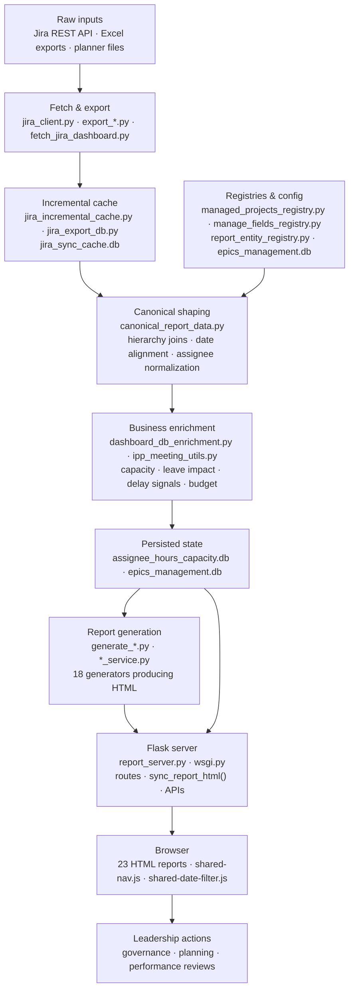

# EPR Tool — Project Architecture

> **Purpose of this document:** Give any LLM, new developer, or stakeholder an instant orientation to the full system — what every module does, how they connect, and where data flows — without needing to read the codebase.

---

## System overview

EPR Tool is a Python-based corporate reporting platform that converts raw Jira delivery records into leadership-ready HTML reports served through a local Flask web server and deployed to Azure App Service. It has no external framework dependencies beyond Flask, openpyxl, and requests.

| Dimension | Detail |
|---|---|
| **Live URL** | `https://epreporting.azurewebsites.net/` |
| **Local entry** | `http://127.0.0.1:3000/introduction.html` |
| **Start command** | `python run_server.py` (auto-selects port 3000–3003) |
| **Deploy trigger** | Push to `main` → `.github/workflows/azure-appservice-deploy.yml` |
| **Primary databases** | `assignee_hours_capacity.db`, `epics_management.db`, `jira_sync_cache.db` |
| **Report count** | 23 HTML reports |
| **Active modules** | 65 |

---

## Architecture diagram

```mermaid
flowchart LR
    subgraph Sources["Source domain"]
        Jira["Jira API\nwork items · worklogs · leaves"]
        Plans["Planning inputs\nbudgets · roadmaps · governance"]
        Calendars["Availability context\nleaves · holidays · patterns"]
    end

    subgraph Layer1["Layer 1 — Jira Export & Integration"]
        E1["export_jira_work_items.py"]
        E2["export_jira_nested_view.py"]
        E3["export_jira_subtask_worklogs.py"]
        E4["export_jira_subtask_worklog_rollup.py"]
        E5["export_ipp_phase_breakdown.py"]
        E6["jira_client.py"]
        E7["jira_incremental_cache.py"]
        E8["jira_export_db.py"]
        E9["fetch_jira_dashboard.py"]
    end

    subgraph Layer2["Layer 2 — Canonical & Registries"]
        C1["canonical_report_data.py"]
        C2["managed_projects_registry.py"]
        C3["manage_fields_registry.py"]
        C4["report_entity_registry.py"]
        C5["ipp_meeting_utils.py"]
    end

    subgraph Layer3["Layer 3 — Report Generators"]
        G1["generate_assignee_hours_report.py"]
        G2["generate_employee_performance_report.py"]
        G3["generate_gantt_chart_html.py"]
        G4["generate_ipp_meeting_dashboard.py"]
        G5["generate_leaves_planned_calendar_html.py"]
        G6["generate_missed_entries_html.py"]
        G7["generate_nested_view_html.py"]
        G8["generate_original_estimates_hierarchy_report.py"]
        G9["generate_phase_rmi_gantt_html.py"]
        G10["generate_planned_actual_table_view.py"]
        G11["generate_planned_rmis_html.py"]
        G12["generate_planned_vs_dispensed_report.py"]
        G13["generate_rlt_leave_report.py"]
        G14["generate_rmi_jira_gantt_html.py"]
        G15["generate_rnd_data_story.py"]
        G16["monthly_epic_plan_progress_service.py"]
        G17["delayed_epic_chain_gantt_service.py"]
        G18["planned_actual_table_view_service.py"]
    end

    subgraph Layer4["Layer 4 — Server & API"]
        S1["report_server.py\n(Flask · all routes · sync)"]
        S2["dashboard_db_enrichment.py"]
        S3["wsgi.py"]
    end

    subgraph Layer5["Layer 5 — HTML Reports (23)"]
        R["introduction · dashboard · executive_dashboard\nassignee_hours · employee_performance · gantt_chart\nipp_meeting · leaves_calendar · missed_entries\nnested_view · original_estimates · phase_rmi_gantt\nplanned_actual · planned_rmis · planned_vs_dispensed\nrlt_leave · rmi_jira_gantt · rnd_data_story\napproved_vs_planned · delayed_epic_chain\nmonthly_epic_progress · team_capacity_planner\ndashboard_template"]
    end

    subgraph Assets["Shared Assets"]
        A1["shared-nav.js"]
        A2["shared-date-filter.js"]
        A3["shared-nav.css"]
        A4["material-symbols.css"]
    end

    Sources --> Layer1 --> Layer2 --> Layer3 --> Layer4 --> Layer5
    Layer2 --> Layer4
    Assets --> Layer5
```

---

## Data flow

---

## Module inventory — 65 modules

### Layer 1 · Jira Export & Integration (8 modules)

| Module | Role |
|---|---|
| `jira_client.py` | Core Jira REST API client — issues, boards, worklogs, subtasks |
| `jira_incremental_cache.py` | Incremental sync: only fetches Jira records changed since last run |
| `jira_export_db.py` | SQLite persistence layer for Jira export cache (`jira_sync_cache.db`) |
| `export_jira_work_items.py` | Full work item hierarchy export (epics → stories → subtasks) |
| `export_jira_nested_view.py` | Nested view structure export for hierarchical report generation |
| `export_jira_subtask_worklogs.py` | Subtask-level worklog extraction per assignee per date |
| `export_jira_subtask_worklog_rollup.py` | Aggregates subtask worklogs up to story/epic level |
| `export_ipp_phase_breakdown.py` | Phase breakdown export for IPP meeting dashboard |
| `fetch_jira_dashboard.py` | Fetches Jira dashboard config, project metadata, and board settings |

### Layer 2 · Canonical Data & Registries (6 modules)

| Module | Role |
|---|---|
| `canonical_report_data.py` | Single source of truth — normalizes and validates all report metrics; other modules read from this |
| `managed_projects_registry.py` | Registry of active projects with metadata, colors, and config; drives project-level filtering |
| `manage_fields_registry.py` | Custom Jira field mapping management; maps field IDs to human names |
| `report_entity_registry.py` | Registry of all report pages, their categories, nav labels, and route definitions |
| `ipp_meeting_utils.py` | Shared utility functions for IPP meeting dashboard logic (date math, phase aggregation) |

### Layer 3 · Report Generators (18 modules)

| Module | Output report | Key logic |
|---|---|---|
| `generate_assignee_hours_report.py` | Assignee hours | Capacity vs logged hours per person; leave-adjusted utilization |
| `generate_employee_performance_report.py` | Employee performance | Scorecard: productivity, penalty, discipline, utilization, resignation tracking |
| `generate_gantt_chart_html.py` | Gantt chart | Interactive timeline from nested view data; swimlanes by project |
| `generate_ipp_meeting_dashboard.py` | IPP meeting dashboard | Phase-level planning vs actuals; meeting-ready delivery status |
| `generate_leaves_planned_calendar_html.py` | Leaves calendar | Employee leave calendar with planned vs actual; team availability heat map |
| `generate_missed_entries_html.py` | Missed entries | Flags worklog data-quality gaps; missing entries by person and date |
| `generate_nested_view_html.py` | Nested view | Epic → story → subtask hierarchy with hours, status, and scoring |
| `generate_original_estimates_hierarchy_report.py` | Original estimates | Estimation breakdown; original vs revised vs actual by epic/project |
| `generate_phase_rmi_gantt_html.py` | Phase RMI Gantt | Phase-gated Gantt; shows RMI timing per delivery phase |
| `generate_planned_actual_table_view.py` | Planned vs actual table | Side-by-side planned/actual hours table with variance columns |
| `generate_planned_rmis_html.py` | Planned RMIs | Resource management items planned per period with status |
| `generate_planned_vs_dispensed_report.py` | Planned vs dispensed | Approved budget vs actual spend; financial variance per epic |
| `generate_rlt_leave_report.py` | RLT leave report | Resource leave tracking calendar; team availability view |
| `generate_rmi_jira_gantt_html.py` | RMI Jira Gantt | Integrated RMI + Jira Gantt with phase and dependency mapping |
| `generate_rnd_data_story.py` | R&D data story | Narrative R&D breakdown; investment split and delivery confidence |
| `monthly_epic_plan_progress_service.py` | Monthly epic progress | Month-over-month epic plan progress; commitment vs delivery trend; estimate hierarchy rollups |
| `delayed_epic_chain_gantt_service.py` | Delayed epic chain | Gantt of epics with delay chains; cascading impact visualization |
| `planned_actual_table_view_service.py` | Planned vs actual (service) | Service layer backing the planned vs actual table API and report |

### Layer 4 · Server & API (5 modules)

| Module | Role |
|---|---|
| `report_server.py` | Main Flask app — all routes, report sync via `sync_report_html()`, REST APIs, static serving |
| `dashboard_db_enrichment.py` | Enriches dashboard data from `epics_management.db`; applies IPP fields, planner meta, story dates |
| `offline_html_prepare.py` | Bundles reports into offline-distributable HTML packages |
| `sync_team_rmi_gantt_sqlite.py` | Syncs team RMI Gantt data from Jira into SQLite for fast report serving |
| `wsgi.py` | WSGI entry point for Azure App Service deployment |

### Layer 5 · HTML Reports (23 reports)

| Report file | Purpose |
|---|---|
| `introduction.html` | Landing page — tool overview, architecture, data flow |
| `dashboard.html` / `dashboard_template.html` | Executive KPI dashboard; epic cards with delivery status |
| `executive_dashboard.html` | High-level executive summary view |
| `assignee_hours_report.html` | Per-person hours: capacity, logged, leave-adjusted |
| `employee_performance_report.html` | Scorecard: productivity, penalty, discipline, utilization |
| `gantt_chart_report.html` | Interactive project Gantt chart |
| `ipp_meeting_dashboard.html` | IPP meeting planner with phase delivery status |
| `leaves_planned_calendar.html` | Team leave calendar with availability heat map |
| `missed_entries.html` | Worklog data-quality gaps by person and date |
| `nested_view_report.html` | Epic → story → subtask hierarchy with hours and scores |
| `original_estimates_hierarchy_report.html` | Original vs revised vs actual estimates |
| `phase_rmi_gantt_report.html` | Phase-gated RMI Gantt chart |
| `planned_actual_table_view.html` | Planned vs actual hours side-by-side table |
| `planned_rmis_report.html` | Planned resource management items |
| `planned_vs_dispensed_report.html` | Approved budget vs actual spend variance |
| `rlt_leave_report.html` | Resource leave tracking calendar |
| `rmi_jira_gantt_report.html` | RMI + Jira integrated Gantt with dependencies |
| `rnd_data_story.html` | R&D investment narrative and breakdown |
| `approved_vs_planned_hours_report.html` | Approved vs planned hours comparison |
| `delayed_epic_chain_gantt_report.html` | Cascading delay chain visualization |
| `monthly_epic_plan_progress_report.html` | Month-over-month epic plan progress |
| `team_capacity_planner.html` | Team capacity planning tool |

### Shared Assets (4 modules)

| Asset | Role |
|---|---|
| `shared-nav.js` | Injects navigation bar into every report; active-state detection; mobile menu |
| `shared-date-filter.js` | Global date range filter component; persists selection across reports |
| `shared-nav.css` | Navigation bar and layout base styles |
| `material-symbols.css` | Google Material Symbols icon font (self-hosted for offline use) |

### Initialization & Config (1 module)

| Module | Role |
|---|---|
| `init_epics_management_db.py` | Creates and migrates `epics_management.db` schema on first run |

---

## Key databases

| Database | Used by | Contains |
|---|---|---|
| `assignee_hours_capacity.db` | `generate_assignee_hours_report.py`, `report_server.py` | Capacity profiles, leave rows, summary metrics per assignee |
| `epics_management.db` | `dashboard_db_enrichment.py`, `report_server.py` | Epic plans, IPP fields, planner settings, story date overrides |
| `jira_sync_cache.db` | `jira_incremental_cache.py`, `jira_export_db.py` | Cached Jira issues, worklogs, last-sync timestamps |

---

## Key routes (report_server.py)

| Route | What it serves |
|---|---|
| `/introduction.html` | Landing page |
| `/report_html/` | Report index |
| `/settings/epics-management` | Epics Planner UI |
| `/settings/epics-management/import` | Epics Planner import |
| `/api/epics-management/rows` | Epics rows API |
| `/api/projects?include_inactive=0` | Active projects API |
| `/api/canonical-refresh` | Triggers canonical data refresh |

---

## Runner scripts

| Script | Purpose |
|---|---|
| `run_server.py` | Start Flask server on port 3000–3003 |
| `run_all.py` | Run all generators sequentially |
| `run_all_exports.py` | Run all Jira export operations |
| `run_html_only.py --no-server` | Regenerate HTML reports without starting server |

---

## Test suite (56 test files)

Tests live in `tests/` and cover API endpoints, report generators, data registries, UI smoke checks, and schema migrations. Run with `pytest tests/`.

---

*Last updated: 2026-05-18 | 65 active modules · 23 HTML reports · 56 tests · 3 SQLite databases*
